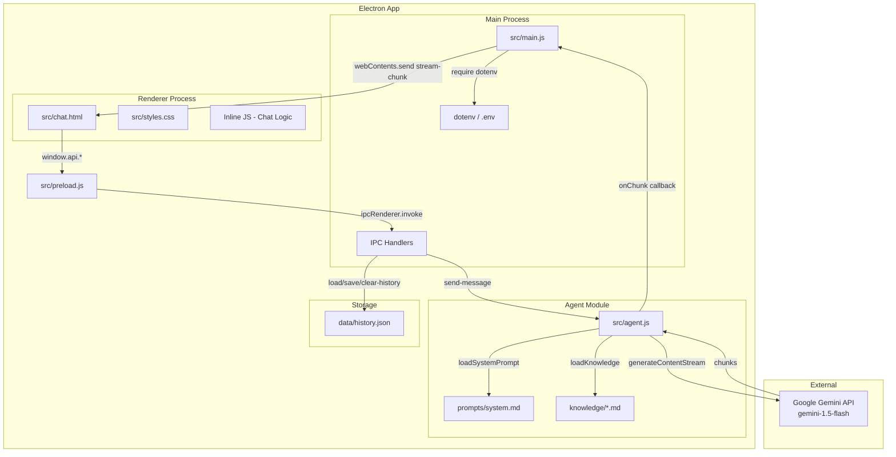
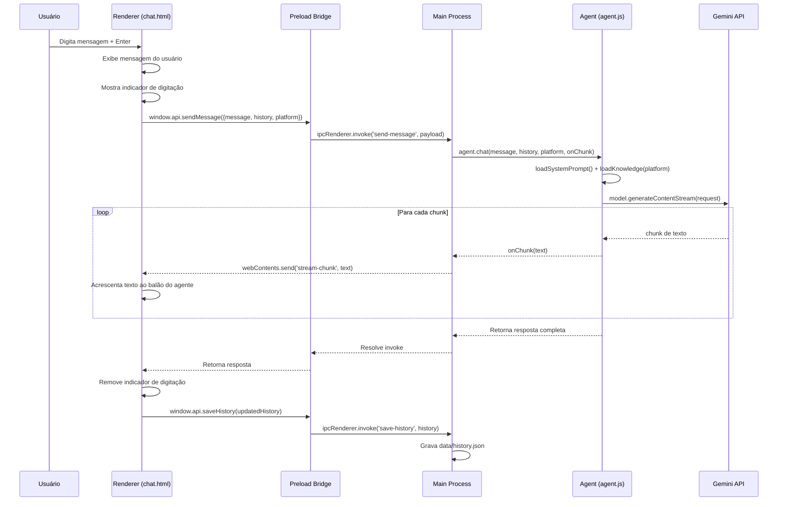

# Design Document — Ads Agent

## Overview

O Ads Agent é um desktop app Electron para Windows que funciona como assistente especialista em gestão de anúncios digitais (Meta Ads, Google Ads, TikTok Ads). A aplicação segue a arquitetura multi-processo do Electron: um Main Process (Node.js) gerencia a janela, IPC e I/O de disco; um Renderer Process exibe a interface de chat; e um módulo Agent encapsula a comunicação com a API do Google Gemini via `@google/generative-ai` SDK.

O fluxo principal é: o usuário digita uma mensagem no chat → o Renderer envia via IPC ao Main Process → o Main Process delega ao Agent → o Agent monta o contexto (system prompt + knowledge base + histórico) e chama `generateContentStream` → chunks de texto são emitidos de volta ao Renderer em tempo real → ao final, o histórico é persistido em `data/history.json`.

A base de conhecimento é composta por arquivos `.md` em `knowledge/` que são carregados dinamicamente conforme a plataforma selecionada pelo usuário. O system prompt em `prompts/system.md` define a identidade, tom e módulos de conhecimento do agente.

### Decisões de Design

- **Google Gemini (gemini-1.5-flash)** em vez de Anthropic Claude: tier gratuito disponível, SDK oficial `@google/generative-ai` com suporte nativo a streaming.
- **Streaming obrigatório**: toda chamada usa `generateContentStream()` para UX responsiva.
- **Knowledge base em arquivos .md**: simples, editável, sem banco de dados. Carregamento seletivo por plataforma reduz tokens enviados à API.
- **Histórico em JSON local**: sem dependência de banco de dados externo. Arquivo único `data/history.json`.
- **contextIsolation + preload bridge**: segurança padrão do Electron — o Renderer nunca acessa Node.js diretamente.

---

## Architecture



### Fluxo de Mensagem (Sequência)



---

## Components and Interfaces

### 1. Main Process (`src/main.js`)

Responsabilidades:
- Criar e configurar a `BrowserWindow` do Electron
- Carregar variáveis de ambiente via `dotenv`
- Validar presença de `GEMINI_API_KEY`
- Registrar handlers IPC para todos os canais
- Delegar chamadas de chat ao módulo Agent
- Repassar chunks de streaming ao Renderer


```typescript
// Interface conceitual dos IPC handlers
interface IPCHandlers {
  'send-message': (event, payload: { message: string, history: HistoryEntry[], platform: Platform }) => Promise<string>
  'load-history': () => Promise<HistoryEntry[]>
  'save-history': (event, history: HistoryEntry[]) => Promise<boolean>
  'clear-history': () => Promise<boolean>
}
```

### 2. Preload Bridge (`src/preload.js`)

Responsabilidades:
- Expor API segura ao Renderer via `contextBridge.exposeInMainWorld`
- Encaminhar chamadas ao Main Process via `ipcRenderer.invoke`
- Gerenciar listeners de streaming

```typescript
// Interface exposta ao Renderer como window.api
interface PreloadAPI {
  sendMessage(payload: { message: string, history: HistoryEntry[], platform: Platform }): Promise<string>
  loadHistory(): Promise<HistoryEntry[]>
  saveHistory(history: HistoryEntry[]): Promise<boolean>
  clearHistory(): Promise<boolean>
  onStreamChunk(callback: (chunk: string) => void): void
  removeStreamListeners(): void
}
```

### 3. Agent Module (`src/agent.js`)

Responsabilidades:
- Carregar system prompt de `prompts/system.md`
- Carregar knowledge base seletivamente por plataforma
- Montar o contexto completo (system instruction + knowledge + histórico)
- Chamar `generateContentStream` da SDK do Gemini
- Emitir chunks via callback para streaming em tempo real

```typescript
// Interface conceitual do módulo Agent
interface AgentModule {
  chat(
    userMessage: string,
    history: HistoryEntry[],
    platform: Platform,
    onChunk: (text: string) => void
  ): Promise<string>
}

// Funções internas
function loadSystemPrompt(): string
function loadKnowledge(platform: Platform): string
```

### 4. Renderer (`src/chat.html` + `src/styles.css`)

Responsabilidades:
- Renderizar interface de chat com sidebar, seletor de plataforma e área de mensagens
- Gerenciar estado local: `currentPlatform`, `chatHistory`, `isStreaming`
- Processar entrada do usuário (Enter para enviar, Shift+Enter para quebra de linha)
- Renderizar markdown básico nas respostas
- Exibir indicador de digitação durante streaming
- Auto-scroll para última mensagem
- Executar Quick Actions (atalhos da sidebar)

```typescript
// Estado do Renderer
interface RendererState {
  currentPlatform: Platform        // 'geral' | 'meta' | 'google' | 'tiktok'
  chatHistory: HistoryEntry[]      // histórico local em memória
  isStreaming: boolean             // flag para evitar envios duplos
}

// Quick Actions disponíveis
interface QuickAction {
  label: string                    // texto exibido no botão
  prompt: string                   // prompt contextualizado enviado ao agente
}
```

### 5. Knowledge Base (`knowledge/*.md`)

Arquivos estáticos carregados pelo Agent conforme a plataforma selecionada:

| Arquivo | Carregamento | Conteúdo |
|---------|-------------|----------|
| `compliance.md` | Sempre | Políticas de publicidade das 3 plataformas |
| `playbooks.md` | Sempre | Playbooks práticos do dia a dia |
| `warmup.md` | Sempre | Protocolos de aquecimento de conta |
| `meta.md` | Quando platform = 'meta' ou 'geral' | Conhecimento específico Meta Ads |
| `google.md` | Quando platform = 'google' ou 'geral' | Conhecimento específico Google Ads |
| `tiktok.md` | Quando platform = 'tiktok' ou 'geral' | Conhecimento específico TikTok Ads |

---

## Data Models

### HistoryEntry

Representa uma mensagem no histórico de conversas.

```typescript
interface HistoryEntry {
  role: 'user' | 'model'    // 'user' para mensagens do usuário, 'model' para respostas do agente
  content: string            // texto da mensagem
}
```

Nota: A SDK do Google Gemini usa `'model'` como role (diferente de `'assistant'` usado por outras APIs).

### Platform

Tipo enumerado para plataformas de anúncios suportadas.

```typescript
type Platform = 'geral' | 'meta' | 'google' | 'tiktok'
```

### History Store (`data/history.json`)

Formato do arquivo de persistência:

```json
[
  { "role": "user", "content": "Como criar um BM do zero?" },
  { "role": "model", "content": "Para criar um Business Manager..." }
]
```

- Array de `HistoryEntry` serializado como JSON
- Criado automaticamente se não existir
- Diretório `data/` criado automaticamente via `fs.mkdirSync({ recursive: true })`
- Limpo para `[]` ao clicar "Novo chat"

### Gemini API Request

Estrutura da chamada à API do Google Gemini:

```typescript
interface GeminiRequest {
  contents: GeminiContent[]           // histórico + mensagem atual
  systemInstruction: { parts: [{ text: string }] }  // system prompt + knowledge
  generationConfig: {
    maxOutputTokens: 4096
  }
}

interface GeminiContent {
  role: 'user' | 'model'
  parts: [{ text: string }]
}
```

### Quick Action Map

Mapeamento de atalhos rápidos para prompts contextualizados:

```typescript
const QUICK_ACTIONS: QuickAction[] = [
  { label: 'Criar conta do zero', prompt: 'Me guie passo a passo para criar uma conta de anúncios do zero na plataforma {platform}...' },
  { label: 'Protocolo de aquecimento', prompt: 'Qual o protocolo completo de aquecimento para uma conta nova na plataforma {platform}?' },
  { label: 'Estruturar campanha', prompt: 'Me ajude a estruturar uma campanha na plataforma {platform}...' },
  { label: 'Diagnóstico de ban', prompt: 'Minha conta foi restrita/banida na plataforma {platform}. O que fazer?' },
  { label: 'Revisar copy/criativo', prompt: 'Revise minha copy/criativo para a plataforma {platform}...' },
  { label: 'Escalar campanha', prompt: 'Como escalar minha campanha na plataforma {platform}?' }
]
```

### Configuração do App (`package.json`)

```json
{
  "name": "ads-agent",
  "version": "1.0.0",
  "main": "src/main.js",
  "dependencies": {
    "@google/generative-ai": "^0.21.0",
    "dotenv": "^16.3.0"
  },
  "devDependencies": {
    "electron": "^28.0.0"
  }
}
```

### Variáveis de Ambiente (`.env`)

```
GEMINI_API_KEY=sua_chave_aqui
```


---

## Correctness Properties

*A property is a characteristic or behavior that should hold true across all valid executions of a system — essentially, a formal statement about what the system should do. Properties serve as the bridge between human-readable specifications and machine-verifiable correctness guarantees.*

### Property 1: Preload bridge exposes correct API contract

*For any* inspection of the preload bridge's exposed API object, it should contain exactly the keys `sendMessage`, `loadHistory`, `saveHistory`, `clearHistory`, `onStreamChunk`, and `removeStreamListeners` — no more, no less — and each function should delegate to the corresponding IPC channel via `ipcRenderer.invoke` or `ipcRenderer.on`.

**Validates: Requirements 2.2, 2.4**

### Property 2: Markdown rendering transformation

*For any* string containing markdown patterns (`**text**`, `` `code` ``, `\n`, `- item`), the markdown rendering function should produce HTML containing the corresponding tags (`<strong>`, `<code>`, `<br>`, `<ul><li>`) while preserving the original text content within those tags.

**Validates: Requirements 3.8**

### Property 3: Platform selection consistency

*For any* platform chip selection (geral, meta, google, tiktok), clicking that chip should: (a) set `currentPlatform` to the corresponding value, (b) ensure exactly one chip has the active visual style, and (c) include that platform value in the payload of any subsequent message sent.

**Validates: Requirements 4.2, 4.3, 4.5**

### Property 4: Quick action prompt generation

*For any* quick action and any currently selected platform, clicking the quick action should populate the input with a prompt that references the current platform, and automatically trigger the send flow without additional user interaction.

**Validates: Requirements 5.2, 5.3, 5.4**

### Property 5: Streaming chunk integrity

*For any* sequence of text chunks received from the Gemini API during a streaming response, the final text displayed in the agent's message bubble should equal the concatenation of all chunks in the order they were received.

**Validates: Requirements 6.3, 6.4**

### Property 6: Knowledge loading by platform

*For any* platform value, the loaded knowledge context should always include the content of `compliance.md`, `playbooks.md`, and `warmup.md`. Additionally, when the platform is a specific one (meta, google, or tiktok), only that platform's `.md` file should be included; when the platform is `geral`, all three platform files should be included. The final system instruction should be the concatenation of the system prompt and all loaded knowledge.

**Validates: Requirements 7.2, 7.3, 7.5**

### Property 7: History persistence round trip

*For any* valid array of `HistoryEntry` objects, saving the array to `data/history.json` via the `save-history` IPC handler and then loading it via the `load-history` IPC handler should return an array equal to the original.

**Validates: Requirements 8.2, 8.4**

### Property 8: History order preservation in API calls

*For any* history array of `HistoryEntry` objects, the `contents` array sent to the Gemini API should contain all history entries in their original chronological order, followed by the current user message as the last entry.

**Validates: Requirements 8.6**

---

## Error Handling

### API Key ausente

- Na inicialização, `main.js` verifica se `process.env.GEMINI_API_KEY` está definida
- Se ausente, exibe diálogo de erro via `dialog.showErrorBox()` e encerra o app
- Mensagem: "Chave da API não encontrada. Configure GEMINI_API_KEY no arquivo .env"

### Falha na chamada à API do Gemini

- `agent.js` envolve a chamada `generateContentStream` em try/catch
- Em caso de erro de rede ou API (rate limit, token inválido), retorna mensagem de erro amigável ao Renderer
- O Renderer exibe a mensagem de erro como uma mensagem do agente com estilo diferenciado
- O histórico NÃO é atualizado com mensagens de erro

### Arquivo de knowledge ausente

- `loadKnowledge()` usa `fs.existsSync()` antes de ler cada arquivo
- Arquivos ausentes são silenciosamente ignorados — o agente funciona com contexto reduzido
- Nenhum erro é lançado ao Renderer

### Histórico corrompido ou ausente

- `load-history` handler usa try/catch ao fazer `JSON.parse()`
- Se o parse falhar ou o arquivo não existir, retorna `[]`
- `save-history` cria o diretório `data/` automaticamente via `fs.mkdirSync({ recursive: true })`

### Erro durante streaming

- Se o stream for interrompido (erro de rede, timeout), o Agent captura a exceção
- O texto parcial já exibido permanece visível
- O Renderer remove o indicador de digitação e exibe mensagem de erro
- O histórico NÃO é salvo com respostas parciais

### Input vazio

- O Renderer valida que o input não está vazio (após trim) antes de enviar
- Mensagens compostas apenas de whitespace são rejeitadas silenciosamente

---

## Testing Strategy

### Abordagem Dual: Unit Tests + Property-Based Tests

A estratégia de testes combina testes unitários para exemplos específicos e edge cases com testes baseados em propriedades para validação universal.

### Biblioteca de Property-Based Testing

- **Biblioteca**: `fast-check` (JavaScript/TypeScript)
- **Configuração**: mínimo 100 iterações por teste de propriedade
- **Tag format**: `Feature: ads-agent, Property {number}: {property_text}`

### Unit Tests (exemplos e edge cases)

Foco em:
- Configuração da BrowserWindow (dimensões, titleBar, backgroundColor) — Req 1.1-1.4
- Flag `--dev` abre DevTools — Req 1.5
- Validação de `GEMINI_API_KEY` ausente — Req 1.7
- Configuração de segurança (contextIsolation, nodeIntegration) — Req 2.1
- Handlers IPC registrados para todos os canais — Req 2.5
- Enter envia, Shift+Enter quebra linha — Req 3.5, 3.6
- Chips de plataforma presentes e "Geral" selecionado por padrão — Req 4.1, 4.4
- Quick Actions listados na sidebar — Req 5.1
- Indicador de digitação aparece e desaparece — Req 6.2, 6.7
- Modelo e maxOutputTokens configurados corretamente — Req 6.6
- System prompt carregado do arquivo correto — Req 7.1
- Plataforma "geral" carrega todos os arquivos — Req 7.4
- Histórico carregado na inicialização — Req 8.1
- Arquivo ausente retorna `[]` — Req 8.3
- Diretório `data/` criado automaticamente — Req 8.5
- "Novo chat" limpa mensagens e chama clearHistory — Req 8.7
- clear-history sobrescreve com `[]` — Req 8.8
- System prompt contém os 6 módulos — Req 9.3
- package.json contém dependências corretas — Req 10.1-10.4
- .gitignore contém `.env` — Req 10.7

### Property-Based Tests

Cada propriedade do design será implementada como um único teste `fast-check`:

1. **Feature: ads-agent, Property 1: Preload bridge API contract** — Gera conjuntos aleatórios de nomes de função e verifica que apenas as 6 funções esperadas estão expostas.

2. **Feature: ads-agent, Property 2: Markdown rendering** — Gera strings aleatórias contendo padrões markdown e verifica que a função de renderização produz as tags HTML correspondentes.

3. **Feature: ads-agent, Property 3: Platform selection consistency** — Gera sequências aleatórias de seleções de plataforma e verifica que o estado (variável, estilo ativo, payload) é sempre consistente.

4. **Feature: ads-agent, Property 4: Quick action prompt generation** — Para cada combinação de quick action × plataforma, verifica que o prompt gerado referencia a plataforma e que o envio é disparado.

5. **Feature: ads-agent, Property 5: Streaming chunk integrity** — Gera arrays aleatórios de strings (chunks) e verifica que a concatenação final exibida é igual à junção de todos os chunks.

6. **Feature: ads-agent, Property 6: Knowledge loading by platform** — Para cada valor de plataforma, verifica que os arquivos corretos são incluídos no contexto e que o system instruction é a concatenação esperada.

7. **Feature: ads-agent, Property 7: History persistence round trip** — Gera arrays aleatórios de `HistoryEntry` (role + content), salva em JSON, carrega de volta e verifica igualdade.

8. **Feature: ads-agent, Property 8: History order preservation** — Gera arrays aleatórios de histórico + mensagem atual e verifica que o array `contents` enviado à API mantém a ordem cronológica com a mensagem atual no final.

### Estrutura de Testes

```
tests/
├── unit/
│   ├── main.test.js          # Testes da configuração do Electron
│   ├── preload.test.js        # Testes do preload bridge
│   ├── agent.test.js          # Testes do módulo agent
│   ├── renderer.test.js       # Testes da lógica do chat
│   └── knowledge.test.js      # Testes de carregamento de knowledge
├── property/
│   ├── markdown.property.js   # Property 2
│   ├── platform.property.js   # Property 3
│   ├── streaming.property.js  # Property 5
│   ├── knowledge.property.js  # Property 6
│   └── history.property.js    # Property 7, 8
```
