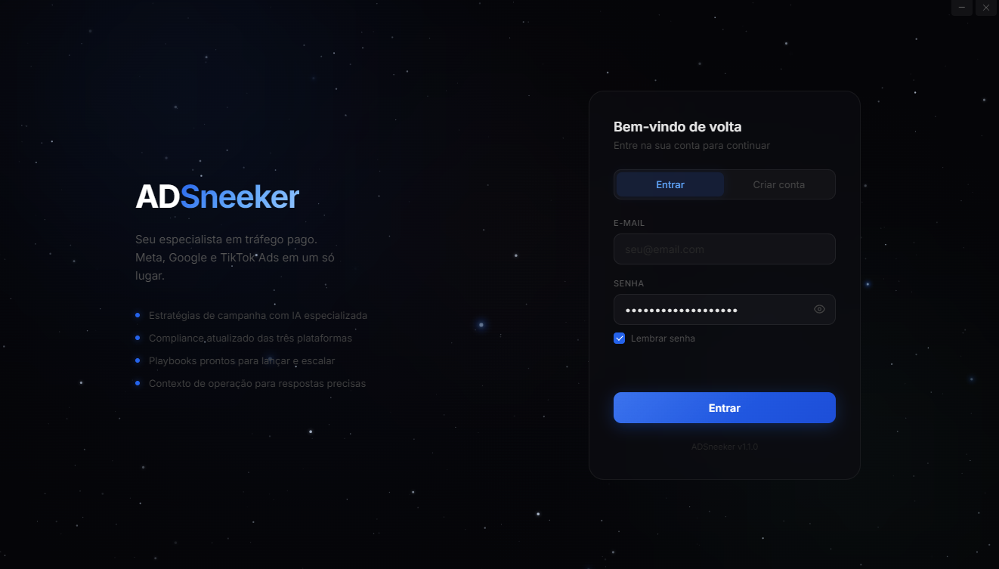
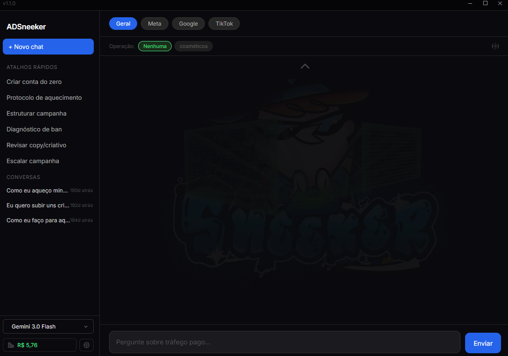
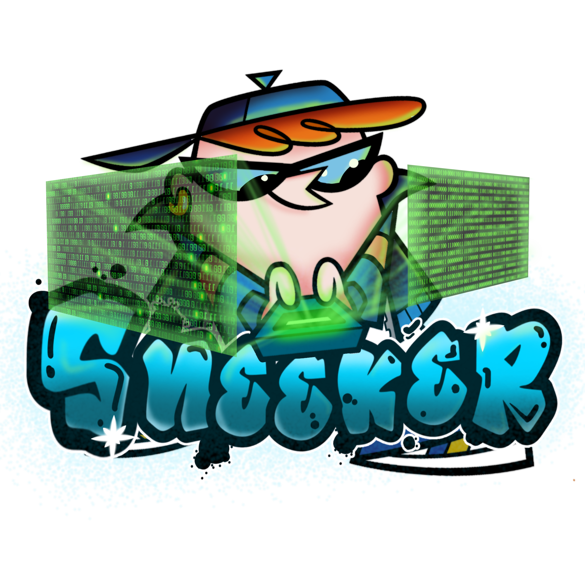

# ADSneeker

> Assistente desktop especialista em gestão de tráfego pago. Meta Ads, Google Ads e TikTok Ads em um só lugar.


ADSneeker é um aplicativo desktop (Electron) que coloca um especialista em tráfego pago ao
alcance de um chat. Em vez de um chatbot genérico, o agente é guiado por um system prompt
rígido e uma base de conhecimento curada sobre criação de contas, aquecimento, estrutura de
campanhas, compliance das plataformas, diagnóstico de bans e escala.

## Sobre o projeto

Quem gerencia anúncios digitais convive com dois problemas constantes: políticas que mudam
o tempo todo e conhecimento espalhado em dezenas de fontes. O ADSneeker centraliza esse
conhecimento num assistente que responde **apenas** sobre tráfego pago, sempre com foco
prático: passo a passo, números de referência e alertas de risco de ban quando aplicável.

O diferencial técnico está em como o contexto é montado. A base de conhecimento (system
prompt + playbooks + guias de compliance por plataforma) é injetada via **context caching**
da API Gemini: o conteúdo estático é cacheado por 24h, de modo que apenas a pergunta do
usuário e o contexto dinâmico (plataforma ativa, operação selecionada) são enviados a cada
mensagem. Isso reduz o custo por chamada de forma significativa, e o app contabiliza esse
custo em tempo real (tokens de entrada, cacheados, saída e storage do cache).

Cada usuário tem conta própria (Supabase Auth) e pode cadastrar a própria chave Gemini, que
é armazenada criptografada com **AES-256-GCM**. A chave de criptografia é derivada por
usuário (scrypt) e nunca trafega em texto claro no banco. Conversas e "operações" (contextos
de negócio reutilizáveis) ficam isolados por usuário via Row Level Security.

## Demonstração

| Login | Chat |
|-------|------|
|  |  |

## Tecnologias

- **[Electron](https://www.electronjs.org/)**: app desktop multi-processo (main / renderer / preload bridge)
- **[Google Gemini](https://ai.google.dev/)** (`@google/generative-ai`): geração com streaming e context caching
- **[Supabase](https://supabase.com/)**: autenticação, Postgres e Row Level Security
- **Node.js `crypto`**: criptografia AES-256-GCM da chave de API por usuário
- **JavaScript (CommonJS)**: sem TypeScript e sem bundler, por escolha de simplicidade

## Funcionalidades

- **Chat especializado em tráfego pago** com respostas em streaming, recusando temas fora de escopo
- **Seletor de plataforma** (Geral, Meta, Google, TikTok) que carrega o guia de compliance correspondente
- **Operações**: contextos de negócio reutilizáveis que o usuário cria e injeta na conversa
- **Múltiplos chats** persistidos por usuário, com título e histórico
- **Seleção de modelo** entre as variantes Gemini (2.5 Flash / Pro / Flash-Lite e previews 3.x)
- **Painel de custo** que calcula o gasto em USD por chamada a partir dos tokens usados
- **Chave Gemini por usuário**, armazenada criptografada; cai para a chave padrão do app quando ausente
- **Atalhos rápidos** para fluxos comuns: criar conta do zero, aquecimento, estruturar campanha, diagnóstico de ban, revisar copy, escalar

## Como rodar

### Pré-requisitos

- [Node.js](https://nodejs.org/) 18+
- Um projeto [Supabase](https://supabase.com/) (gratuito serve)
- Uma chave de API do [Google AI Studio](https://aistudio.google.com/app/apikey)

### Instalação

```bash
# 1. Instalar dependências
npm install

# 2. Configurar variáveis de ambiente
cp .env.example .env
# edite o .env com suas credenciais (veja a tabela abaixo)

# 3. Criar as tabelas no Supabase
# execute o conteúdo de supabase/schema.sql no SQL Editor do seu projeto
```

### Variáveis de ambiente

Preencha o `.env` a partir do `.env.example`:

| Variável | Descrição |
|----------|-----------|
| `SUPABASE_URL` | URL do projeto Supabase (Settings → API) |
| `SUPABASE_ANON_KEY` | Chave anônima/pública do projeto Supabase |
| `GEMINI_API_KEY` | Chave padrão da API Gemini (usuários podem cadastrar a própria pela UI) |
| `ENCRYPTION_SALT` | String aleatória longa para derivar a chave de criptografia (ex.: `openssl rand -hex 32`) |

### Execução

```bash
# Modo produção
npm start

# Modo desenvolvimento (abre o DevTools)
npm run dev
```

## Estrutura do projeto

```
ads-sneeker/
├── src/
│   ├── main.js      # processo principal do Electron: janelas, IPC, persistência de uso
│   ├── preload.js   # bridge segura (contextBridge) entre renderer e main
│   ├── agent.js     # montagem de contexto, context caching e chamada à API Gemini
│   ├── auth.js      # autenticação via Supabase
│   ├── db.js        # operações, configurações e chats no Supabase
│   ├── crypto.js    # criptografia AES-256-GCM da chave Gemini por usuário
│   ├── login.html   # tela de login/cadastro
│   └── chat.html    # interface de chat (renderer)
├── knowledge/       # base de conhecimento em Markdown (playbooks, compliance, etc.)
├── prompts/
│   └── system.md    # system prompt que define identidade e escopo do agente
└── supabase/
    └── schema.sql   # tabelas e políticas de Row Level Security
```

## Decisões técnicas

- **Context caching em vez de reenviar o contexto a cada mensagem.** A base de conhecimento é
  grande e estável; cacheá-la por 24h troca um custo recorrente por um custo único de storage,
  reduzindo o preço por pergunta. Quando o cache falha, o app cai para o modo normal com
  `systemInstruction`, sem quebrar a conversa.
- **Chave de API por usuário, criptografada.** Cada usuário pode usar a própria chave Gemini.
  Ela é guardada cifrada (AES-256-GCM, chave derivada via scrypt a partir do `userId` + salt),
  então um vazamento do banco não expõe as chaves em texto claro.
- **Isolamento por Row Level Security.** Toda tabela (operações, configurações, chats) usa
  políticas `auth.uid() = user_id`, delegando a segurança ao Postgres em vez de confiar só na
  aplicação.
- **Electron endurecido.** `contextIsolation: true` e `nodeIntegration: false`; o renderer só
  acessa o backend por meio de uma API explícita exposta no preload.

## Licença

Distribuído sob a licença MIT. Veja o arquivo [LICENSE](LICENSE) para detalhes.

<div align="center">
  <br>
  <br>
  <br>
  <br>
  
  <br>
  <sub>Made by <strong>TechSneeker</strong></sub>
</div>
